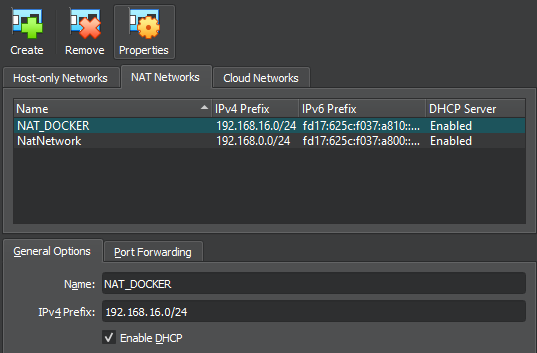
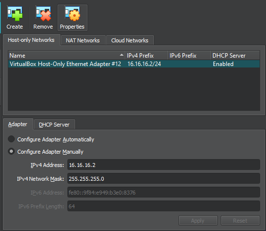
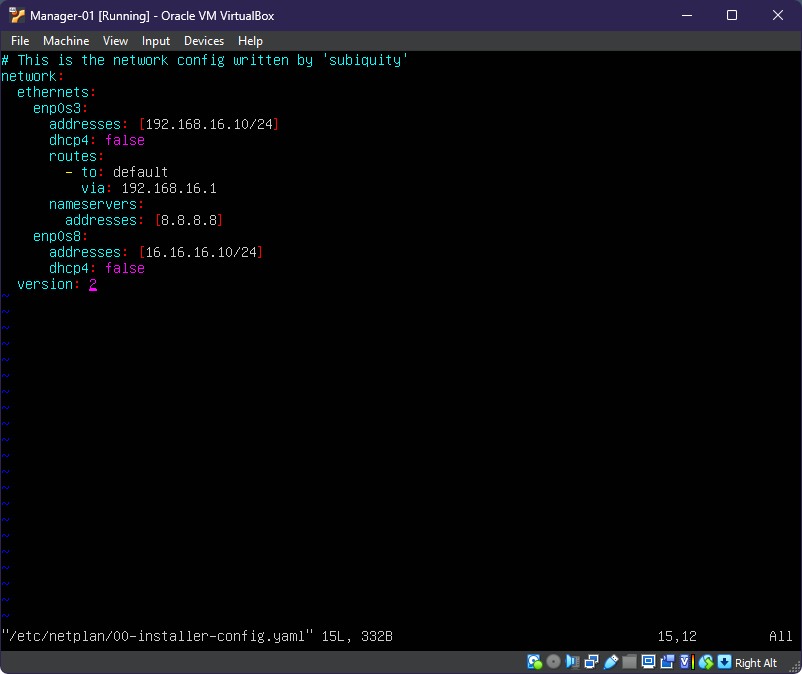
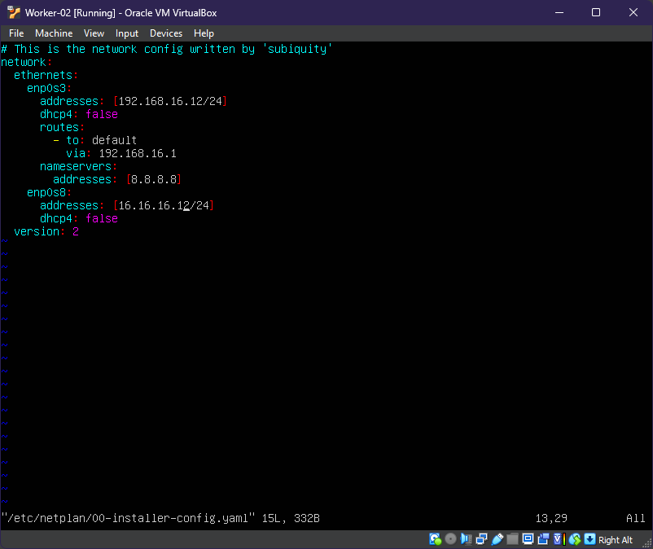
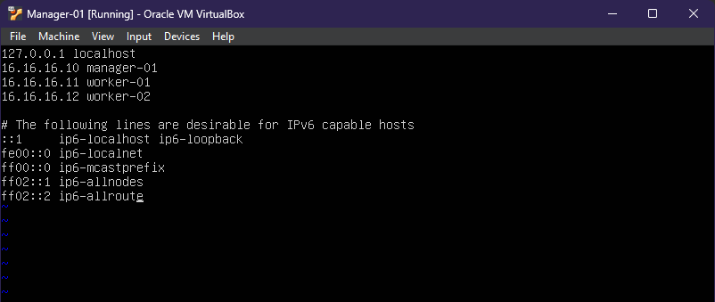

[](https://github.com/zaidanm16/widan-store/)

## HIGH AVAILABILITY WITH DOCKER SWARM

Build high availability for top up game service as a solution to reduce excessive use of resources on the server side.
Using HAProxy with roundrobin algorithm.

Created by [Muhammad Zaidan](http://azem.my.id).

## Table of Contents

* [Getting Started](#Getting-Started)
  * [Create VM](#Create-VM)
  * [Install Docker](#Install-Docker)
  * [Setup User](#Setup-User)
* [Setup App Source Code](#Setup-App-Source-Code)
* [Initialization Swarm](#Initialization-Swarm)
  * [Manager Node](#Manager-Node)
  * [Worker Node](#Worker-Node)
* [Build & Push Image](#Build--Push-Image)
  * [Database](#Database)
  * [App](#App)
* [Deploy Stack](#Deploy-Stack)
* [Monitoring](#Monitoring)
* [Test Application](#Test-Application)

## Getting Started
We need to setup 3 Virtual Machine using VirtualBox, then install docker & setup user to run docker command without root privileged. 

### Create VM
In this lab environment we use the Ubuntu 22.04 OS, with the following specifications 

No | Virtual Machine | Spesification | NATNetwork | Host-Only Network
---- | ---- | ---- | ---- | ----
1 | Manager-01 | 1vcpu, 2GB Ram | 192.168.16.10/24 | 16.16.16.10/24
2 | Worker-01 | 1vcpu, 1GB Ram | 192.168.16.11/24 | 16.16.16.11/24
3 | Worker-02 | 1vcpu, 1GB Ram | 192.168.16.12/24 | 16.16.16.12/24

There are 2 networks, namely NAT Network for internet access needs and Host-Only Network for remote VM needs from the Host and used for communication between vm.

NATNetwork :  
[]()

Host-Only Network :  
[]()

Edit /etc/netplan/00-installer-config.yaml on each node :  
[]()
[]()
[]()

Apply network configuration & change hostname
```sh
sudo netplan apply
sudo hostnamectl hostname manager-01
```
```sh
sudo netplan apply
sudo hostnamectl hostname worker-01
```
```sh
sudo netplan apply
sudo hostnamectl hostname worker-02
```

Map host in /etc/hosts on each node
[]()

Create a ssh-keygen on windows host so you can ssh without a password
```Powershell
PS C:\Users\Zai> ssh-keygen
PS C:\Users\Zai> type $env:USERPROFILE\.ssh\id_rsa.pub | ssh zai@16.16.16.10 "cat >> .ssh/authorized_keys"
```

Check if the host can access without using a password (passwordless).
```Powershell
PS C:\Users\Zai> ssh zai@16.16.16.10 "whoami; hostname"
zai
manager-01
PS C:\Users\Zai>
```

### Install Docker
There is two method to install Docker Engine, using docker install script or using script that i made.
1. Docker install script from docker.com
```sh
curl -sSL https://get.docker.com/ | sudo sh
```
2. Docker install script from my git repository
```sh
git clone https://github.com/zaidanm16/docker-ha.git
cd installation_docker
sudo chmod u+x install-jammy.sh
sudo ./install-jammy.sh
```

Test Installed Docker Engine
```sh
docker version
docker info
sudo systemctl status docker
```

### Setup User
Add user to docker group, so user can run docker command without root privileged.  
Run user.sh from my git repository
```sh
sudo chmod u+x user.sh
sudo ./user.sh
```
or you can manually run
```sh
sudo usermod -aG docker $USER
sudo chmod 666 /var/run/docker.sock
```

## Setup App Source Code
Move all your application source code into the web/app directory
```sh
cd web/app
git clone https://github.com/zaidanm16/widan-store.git .
```

## Initialization Swarm
Steps to initialization docker swarm cluster with 1 manager node and 2 worker node

### Manager Node
You need login to dockerhub with your account then init the swarm cluster
```sh
docker login -u [username]
docker swarm init --advertise-addr 16.16.16.10
```
Copy command docker join, token will be used by worker node
```sh
docker swarm join-token worker
```
Run this command after worker node already join
```sh
docker node ls
```

### Worker Node
You can get your swarm [TOKEN] from manager node
```sh
docker swarm join --token [TOKEN] 16.16.16.10:2377
```

## Build & Push Image
In this section we will build image for our application & push it to docker hub

### Database
Build database image using Dockerfile.
Before build the image, edit the Dockerfile according to your needs. I'm using mariadb image with version 10.7.8. You can read comments in the Dockerfile, to see explanation for every steps in building the image.  
Note :  
> [username] is your docker hub account  
> [image-name] is your image name  
> [tag] is your image tag or your image version  
> [path] is path to Dockerfile, if Dockerfile is in the same directory you can use dot (.)
```sh
cd db
docker build -t [username]/[image-name]:[tag] [path]
```
So mine is :
```sh
docker build -t kevinmz/mariadb:10.7.8 .
```
After building succeed, you can push the image to dockerhub
```sh
docker push [username]/[image-name]:[tag]
```
So mine is :
```sh
docker push kevinmz/mariadb:10.7.8
```

### App
Build your application using Dockerfile. Before build the image, edit the Dockerfile according to your needs. I'm using php image with version 8.1 and using Apache HTTPD as web Server. You can read comments in the Dockerfile, to see explanation for every steps in building the image.  
Note :  
> [username] is your docker hub account  
> [image-name] is your image name  
> [tag] is your image tag or your image version  
> [path] is path to Dockerfile, if Dockerfile is in the same directory you can use dot (.)
```sh
cd db
docker build -t [username]/[image-name]:[tag] [path]
```
So mine is :
```sh
docker build -t kevinmz/app-widan:v1 .
```
After building succeed, you can push the image to dockerhub
```sh
docker push [username]/[image-name]:[tag]
```
So mine is :
```sh
docker push kevinmz/app-widan:v1
```

## Deploy Stack

Before deploy the stack, you need to configure haproxy.conf according your needs.  
Deploy your stack application in widan.yml & create secret for db password in widan.yml  
- Using script to deploy & create secret
```sh
sudo chmod u+x deploy.sh
sudo ./deploy.sh
```
- Manually create secret & deploy stack
```
echo '[your_password]' | docker secret create mysql_root_password -
docker stack deploy -c [compose-file] [stack-name] --with-registry-auth
```

Example :
```sh
echo 'pa$$w0rd' | docker secret create mysql_root_password -
docker stack deploy -c widan.yml widan --with-registry-auth
```

After deploy succeed, run docker service to see that service is replicated & running or not.
```sh
docker service ls
```

You can check each service
```sh
docker service ps widan_web
docker service ps widan_db
docker service ps widan_lb
```

Run the Application from Windows Host at
http://[manager-ip]  
http://16.16.16.10

## Monitoring
See your haproxy load balancing stats at http://[manager-ip]/haproxy?stats  
http://16.16.16.10/haproxy?stats

Login using credentials that you create at haproxy.cfg

## Test Application
Testing Performance of the Application

`BELUM BERES`

---